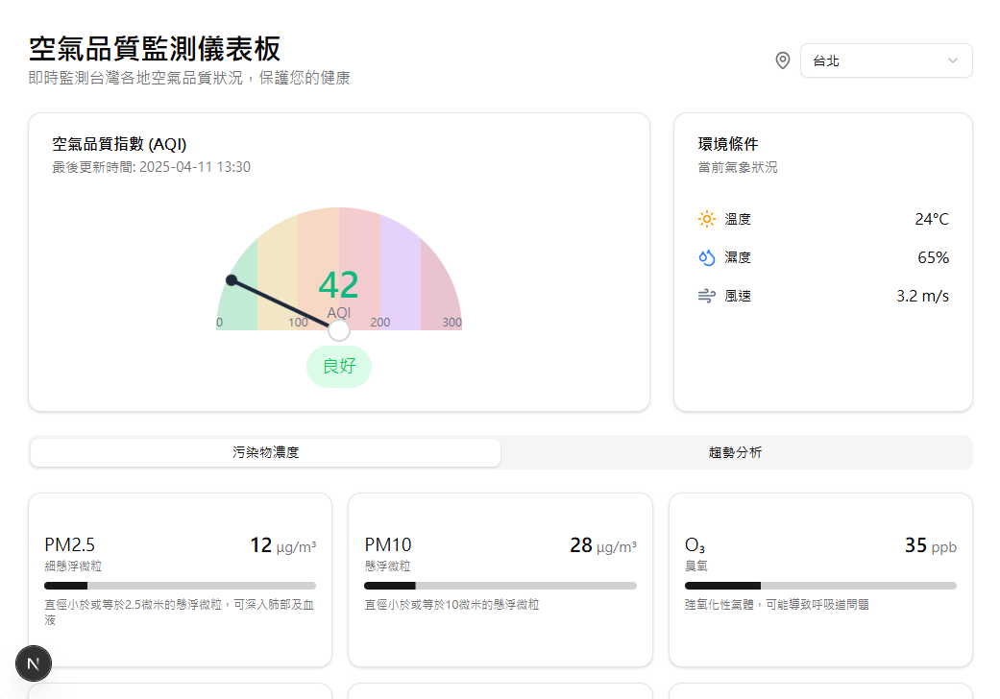

# Air Quality Dashboard

## Description

The **Air Quality Dashboard** is a real-time air quality monitoring system designed to help users track and analyze various air quality parameters, including PM2.5, CO2, temperature, and humidity. Integrated with **ShadCN UI** and built using **Next.js**, this dashboard offers an intuitive and interactive user interface for displaying real-time data and historical trends. The goal of this project is to provide users with an easy way to monitor air quality and make informed decisions for improving their environment.

## Features

- **Real-time Monitoring**: Continuously tracks air quality data, including PM2.5, CO2 levels, temperature, and humidity.
- **ShadCN UI Integration**: Beautifully designed UI with **ShadCN** components to ensure a seamless and responsive experience.
- **Data Visualization**: Visual representations like graphs and charts make it easier to interpret air quality trends over time.
- **Alerts & Notifications**: Get notifications when air quality parameters fall outside safe thresholds.
- **Customizable Dashboard**: The dashboard is flexible and can be adapted to display the specific data relevant to the user’s environment.
- **Sensor Integration**: Support for integrating various air quality sensors for real-time data collection.

## Installation

### Prerequisites

Ensure you have the following installed:

- **Node.js** (>=14.x)
- **npm** or **yarn**
- Sensor hardware for monitoring air quality (e.g., PM2.5 sensor, CO2 sensor, etc.)

### Steps to Install

1. Clone the repository:

   ```bash
   git clone https://github.com/yourusername/air-quality-dashboard.git

2. Navigate into the project directory:

   ```bash
   cd air-quality-dashboard

3. Install the required dependencies:

   ```bash
   pnpm install
   # or if you're using yarn:
   yarn install

4. Set up the air quality sensors (refer to your sensor's manual for setup instructions).

5. Run the development server:

   ```bash
   pnpm dev
   # or if you're using yarn:
   yarn dev

6. Open your browser and go to http://localhost:3000 to view the air quality dashboard.


## Usage
Once the server is running, the Air Quality Dashboard will display air quality data, including:

- PM2.5
- CO2 Levels
- Temperature
- Humidity

The dashboard allows users to visualize these parameters with graphs, historical trends, and also provides notifications for when values exceed predefined safe thresholds.


